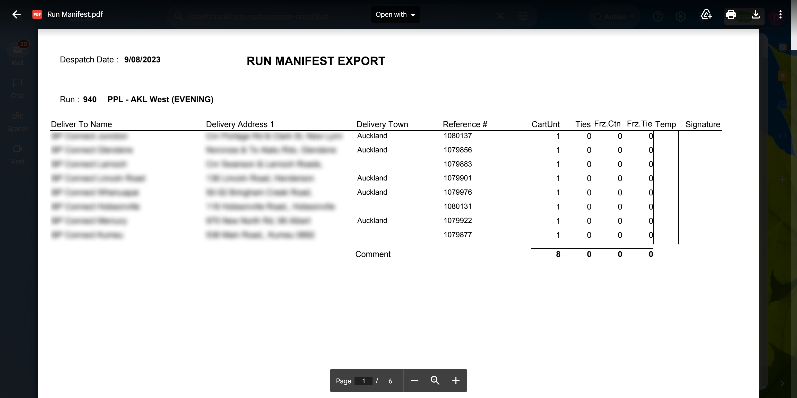

# PDF Delivery Manifests Merging and Text Extraction

## Introduction
The "Automated Delivery Manifests" Python project streamlines the process of extracting essential delivery information from multiple PDF files received from LSG, a leading sandwich manufacturer in New Zealand. The project aims to enhance efficiency by reducing the time spent on manual data entry, allowing quick updates to the system with accurate delivery details.

This will reduce the time taken to update the online delivery dockets by 70% and minimizing data entry errors.

## Features
**PDF Merging**: The script takes any number of separate PDF delivery manifests as input and merges them into a single PDF file. This consolidated file makes it easier to data extraction in the next stage.

**Text Extraction**: After merging the PDFs, the script employs regular expressions to extract specific text and number patterns from the pages. This extracted text contains valuable information related to deliveries, such as Purchase Orders and Quantity of items/packages to deliver.

- LSG sends daily 10 to 12 PDF files via email to the BCPPL Admin
- Handling all files and opening them one by one and checks quantity updates is a timlely task.
- So, I have come up with this easy solution to extract every purchase order and total quantity from each delivery and exporting data to a csv file.
- Then, Admin can use the csv file to update the system accordingly.

Below is a screenshot of a manifest sent by LSG to BCPPL Admin in PDF format.

## Project Workflow:

### Downloading PDF Files:
The first step involves downloading all the PDF files received from LSG into a designated "data" folder. These PDF files contain delivery manifests with important details such as sales purchase order numbers, store names, addresses, and box quantities.

*Importing Required Python Packages*

### PDF Merging:
The Python script employs the "pdfmerger" library to merge all the individual PDF files into a single consolidated PDF file. This simplifies the subsequent text extraction process.

### Text Extraction using Regular Expressions:
The project utilizes regular expressions (regex) to search for specific patterns within the merged PDF file's text. The pattern seeks to identify:

- Sales purchase order numbers with 7 digits
- Number of boxes with 4 digits

### Data Extraction and CSV Export:
Once the relevant information is extracted using regex, the script compiles this data into a structured format. This includes matching purchase order numbers with their respective box quantities. The compiled data is then exported to a CSV (Comma-Separated Values) file.

### Efficiency and Time Savings:
Prior to automation, the manual data entry process took approximately 20 to 30 minutes to review and update the delivery orders. With the implementation of the automated Python script, this task can now be completed within just 5 minutes. The accuracy of the extracted information reduces the risk of errors that could occur during manual data entry.

## Limitations
The accuracy of text extraction depends on the quality and consistency of the input PDFs.
Complex PDF layouts or non-standard fonts may affect the effectiveness of text extraction.

## Benefits

- **Significant time savings**: Reduces the delivery updates process from 20-30 minutes to 5 minutes.
- **Enhanced accuracy**: Automation eliminates the possibility of human errors during data entry.
- **Streamlined workflow**: The project simplifies the entire process from PDF merging to CSV export.
- **Scalability**: The script can handle a growing number of PDF files efficiently.

## Conclusion:
The "Automated Delivery Updates" Python project revolutionizes the way delivery information is processed and updated within the system. By eliminating manual data entry, the project maximizes efficiency, minimizes errors, and empowers users to focus on more value-added tasks. The documentation provides a clear overview of the project's workflow, benefits, and its positive impact on daily operations.

Code : 
[Screenshots\LSG-Project.pdf]